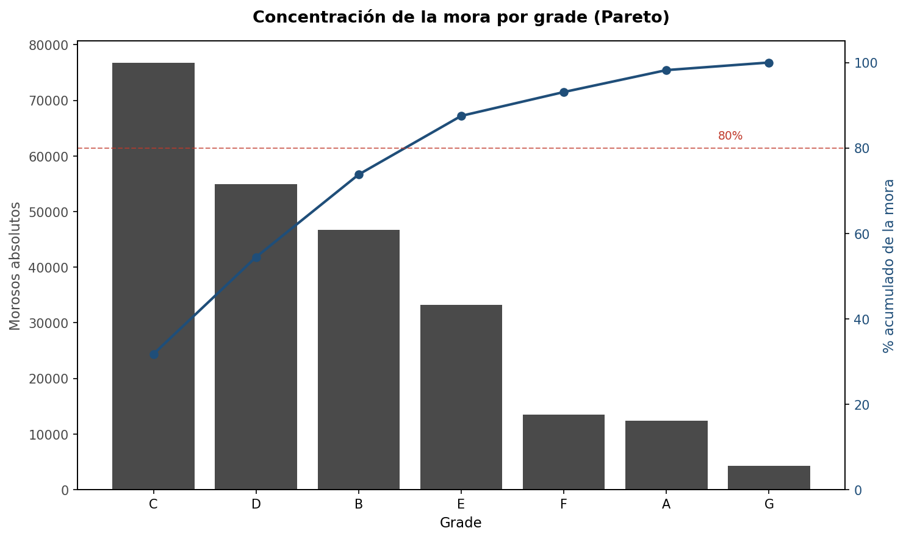
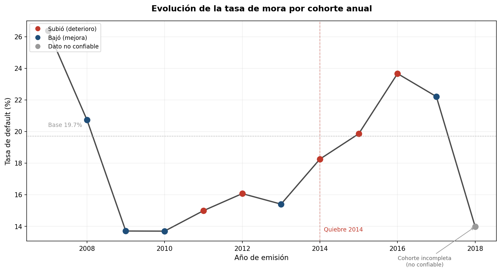
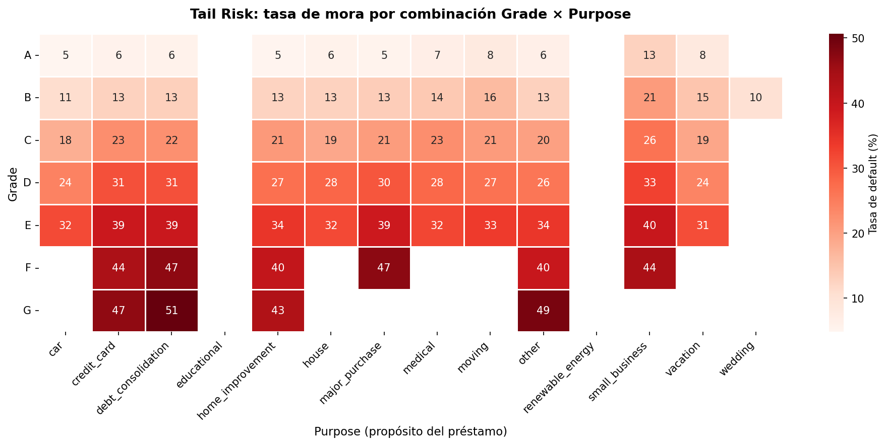

*Read this in other languages: [Español](README.es.md)*

# Default Risk Analysis — LendingClub (P2P Lending)

Credit risk analysis conducted on **1.23 million loans** from LendingClub, a leading peer-to-peer (P2P) lending platform. The project identifies **which characteristics predict a loan falling into default**, leveraging PostgreSQL for advanced SQL analysis and Python for data preparation and visualization.

This project is tailored for the **fintech credit and P2P lending industry**, where evaluating and monitoring default risk lies at the core of the business.

---

## Central Question

> What characteristics predict whether a loan will default?

**Portfolio Baseline Default Rate: 19.7%** — approximately 1 out of every 5 completed loans defaulted. Every analysis in this project aims to identify **where and why** the data deviates from this baseline.

---

## Tech Stack

| Tool | Usage |
|---|---|
| **Python** (pandas, NumPy) | Data cleaning and preparation (2.26M → 1.23M rows) |
| **PostgreSQL** | Advanced SQL analysis (window functions, CTEs) |
| **Matplotlib / Seaborn** | Visualizations & plots |

---

## Repository Structure

```text
lending_club_sql_risk/
├── README.md                    # this file
├── 01_data_cleaning.ipynb       # Python data preparation
├── 02_risk_analysis.sql         # the 5 documented SQL queries
├── data/
│   └── README.md                # instructions on how to obtain the dataset
└── img/
    ├── 01_pareto_grade.png
    ├── 02_annual_cohorts.png
    └── 03_tail_risk.png
```

---

## Data Preparation

The raw dataset (2.26M rows) was filtered and refined to **1,230,327 completed loans** using the following steps:

- **Selection of 15 key columns** highly relevant to credit risk.
- **Domain-specific null handling:** For instance, null values in delinq_2yrs (historical delinquencies) were filled with 0 after discovering they systematically belonged to loans under an older credit policy, rather than representing random missing data.
- **Type casting:** term and emp_length (text → integer), and issue_d (text → date).
- **Target variable construction (default):** A binary flag (1 = Charged Off, 0 = Fully Paid), excluding active loans (Current) since their outcome is still unknown and would contaminate the analysis.
- **Outlier treatment:** Distinguishing data entry errors (negative DTI or DTI > 100, absurd income values) from legitimate, high-income outliers.

---

## Analysis & Findings

### 1. Risk Concentration by Grade

LendingClub's internal grading system (grade, A through G) effectively predicts default: the default rate grows monotonically from 5.8% (Grade A) to 49.4% (Grade G). This proves the scoring model successfully discriminates credit risk.

### 2. Default Concentration (Pareto Principle)



Key Finding — The Individual vs. Aggregate Risk Paradox: While Grade G is the riskiest loan-by-loan (49.4% default rate), it contributes only 1.8% of total portfolio defaults due to its low origination volume. Conversely, three grades (C, D, and B) concentrate 73.8% of all defaults due to their massive scale.

Business Insight: Risk monitoring must prioritize volume × rate, not just the individual rate. Keeping a close eye on grades C, D, and B covers 3 out of every 4 defaulted loans in the portfolio.

### 3. Temporal Evolution by Annual Cohort



The quality of the credit portfolio deteriorated as origination volume expanded. After stabilizing post-financial crisis (2010–2013), the default rate spiked in 2014 and reached its peak in 2016 (23.7%). This pattern strongly suggests a relaxation of underwriting standards during a phase of aggressive growth.

> **Methodological Note:**  The apparent "improvement" in 2018 is an incomplete cohort artifact. 60-month loans issued in 2018 had not yet reached their maturity date at the time of data collection, artificially lowering their default rate. The chart explicitly flags this data point as unreliable.

### 4. Year-over-Year (YoY) Variation

By applying the LAG() window function to the annual rates, YoY deltas precisely locate the underwriting tipping point in 2014 (+2.9 pp) and the maximum portfolio deterioration in 2016 (+3.8 pp). The abrupt -8.2 pp drop in 2018 quantitatively confirms the incomplete cohort bias.

### 5. Tail Risk — Grade × Purpose Combinations



When crossing grade with loan purpose, the grade heavily dominates the purpose: Grades F and G remain highly risky regardless of what the borrower uses the money for. The most toxic combination is Grade G + debt_consolidation (50.6% default rate).

**Business Insight:** Pockets of extreme risk with significant volume are Grade F + debt_consolidation (19,391 loans, 46.9% default) and Grade E + debt_consolidation (56,340 loans, 39.4% default). These are prime candidates for higher interest rates or outright rejection.

---

## Applied SQL Techniques

- **Window Functions:** 'SUM() OVER ()' to compute Pareto metrics (running totals and percentages of the total), and 'LAG()' for YoY delta analysis.
- **Common Table Expressions (CTEs):** Used to modularize aggregates-on-aggregates (such as cohorts with multi-step deltas).
- **Conditional Aggregation:** 'AVG(default_flag)' used to compute the default rate, and 'SUM(default_flag)' for absolute counts.
- **Group Filtering:** 'HAVING COUNT(*) >= 500' to exclude combinations lacking sufficient statistical significance.

---

## Next Steps

- **Predictive Default Modeling:** With the clean dataset and binary target variable already built, the next natural step is to train a classification model (Logistic Regression as a baseline, followed by Random Forests/XGBoost) to predict individual loan default probabilities.
- **Loss Severity Analysis (LGD):** Incorporate recovery data to estimate not just if a loan will default, but how much capital is actually lost (Loss Given Default).
- **Borrower Segmentation:** Cluster borrowers by risk profile to develop risk-based pricing strategies.
- **Interactive Dashboard:** Connect these findings to a Power BI dashboard for real-time portfolio risk monitoring.

---

# How to Reproduce

1. Download the LendingClub dataset (see instructions in 'data/README.md').
2. Run '01_data_cleaning.ipynb' to generate the clean CSV file.
3. Create the database schema in PostgreSQL and load the clean data.
4. Execute the SQL scripts located in '02_risk_analysis.sql'.

*Portfolio project focused on credit risk analysis in P2P lending and fintech.*
